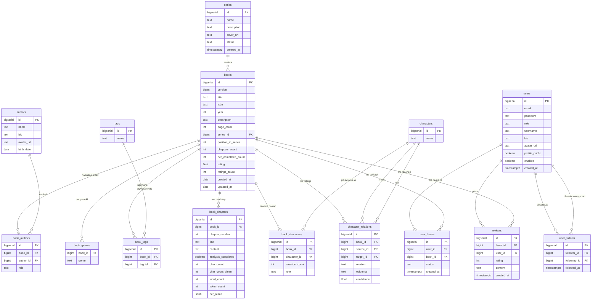

```mermaid
erDiagram
  users {
    bigserial id PK
    text email
    text password
    text role
    text username
    text bio
    text avatar_url
    boolean profile_public
    boolean enabled
    timestamptz created_at
  }
  user_follows {
    bigserial id PK
    bigint follower_id FK
    bigint following_id FK
    timestamptz followed_at
  }
  series {
    bigserial id PK
    text name
    text description
    text cover_url
    text status
    timestamptz created_at
  }
  authors {
    bigserial id PK
    text name
    text bio
    text avatar_url
    date birth_date
  }
  books {
    bigserial id PK
    bigint version
    text title
    text isbn
    int year
    text description
    int page_count
    bigint series_id FK
    int position_in_series
    int chapters_count
    int ner_completed_count
    float rating
    int ratings_count
    date created_at
    date updated_at
  }
  book_authors {
    bigserial id PK
    bigint book_id FK
    bigint author_id FK
    text role
  }
  book_genres {
    bigint book_id FK
    text genre
  }
  tags {
    bigserial id PK
    text name
  }
  book_tags {
    bigserial id PK
    bigint book_id FK
    bigint tag_id FK
  }
  book_chapters {
    bigserial id PK
    bigint book_id FK
    int chapter_number
    text title
    text content
    boolean analysis_completed
    int char_count
    int char_count_clean
    int word_count
    int token_count
    jsonb ner_result
  }
  characters {
    bigserial id PK
    text name
  }
  book_characters {
    bigserial id PK
    bigint book_id FK
    bigint character_id FK
    int mention_count
    text role
  }
  character_relations {
    bigserial id PK
    bigint book_id FK
    bigint source_id FK
    bigint target_id FK
    text relation
    text evidence
    float confidence
  }
  user_books {
    bigserial id PK
    bigint user_id FK
    bigint book_id FK
    text status
    timestamptz created_at
  }
  reviews {
    bigserial id PK
    bigint book_id FK
    bigint user_id FK
    int rating
    text content
    timestamptz created_at
  }

  users ||--o{ user_follows : "obserwuje"
  users ||--o{ user_follows : "obserwowany przez"
  users ||--o{ user_books : "ma na polce"
  users ||--o{ reviews : "pisze"
  series ||--o{ books : "zawiera"
  books ||--o{ book_authors : "napisana przez"
  books ||--o{ book_genres : "ma gatunki"
  books ||--o{ book_tags : "tagowana"
  books ||--o{ book_chapters : "ma rozdzialy"
  books ||--o{ book_characters : "zawiera postac"
  books ||--o{ character_relations : "ma relacje"
  books ||--o{ user_books : "na polkach"
  books ||--o{ reviews : "ma recenzje"
  authors ||--o{ book_authors : "napisal"
  tags ||--o{ book_tags : "przypisany do"
  characters ||--o{ book_characters : "pojawia sie w"
  characters ||--o{ character_relations : "zrodlo"
  characters ||--o{ character_relations : "cel"
```
